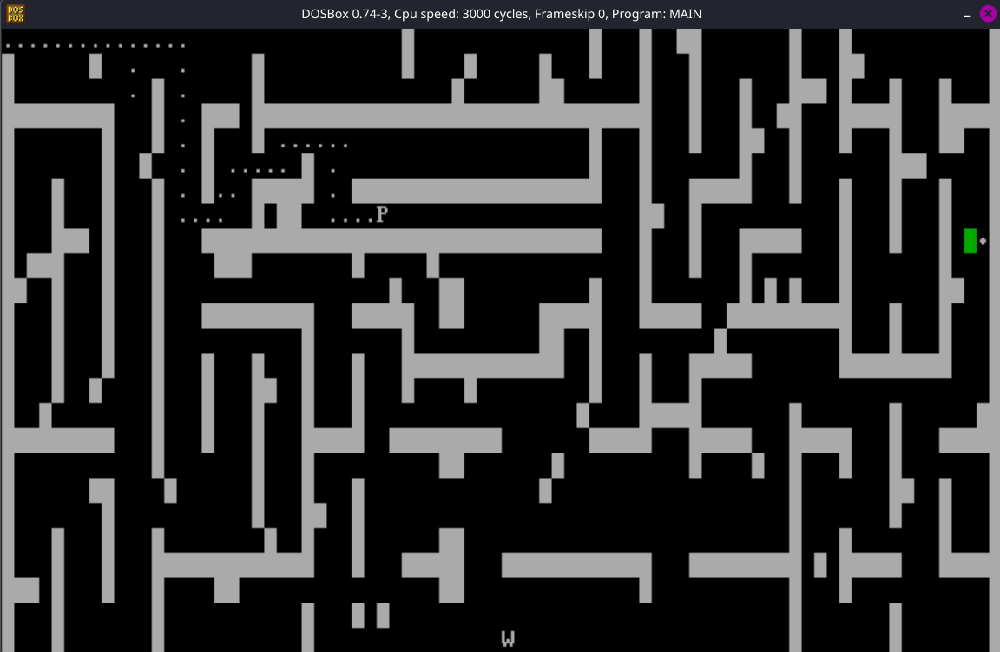

# MAZE
Hardcoded maze game made in 16-bit assembly `IAPx88`

## HOW TO

### Run

* Install [DOSBox](https://www.dosbox.com/)
* Run the following:
```bash
git clone https://github.com/PremadeS/maze
cd maze
dosbox .
``` 
If you're on **Windows** you need to mount the directory where maze is located in **dosbox** 

* Inisde **DOSBox**:
```bash
nasm main.asm -o maze.com
```
```bash
maze.com
```
### Play
* `P`  is **player**
* use `WASD` to move
* Reach `W` to **win**

## Preview


## License
* MIT
